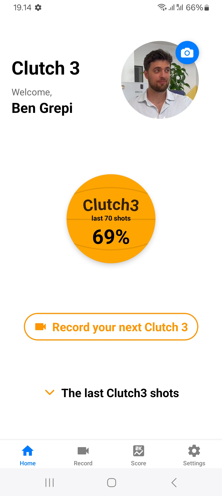
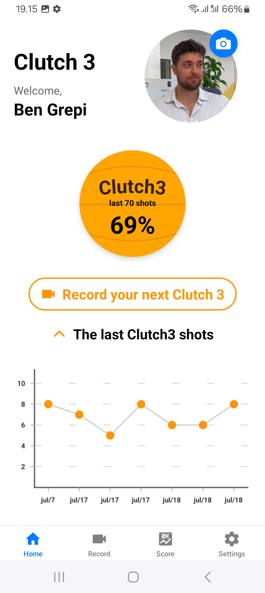
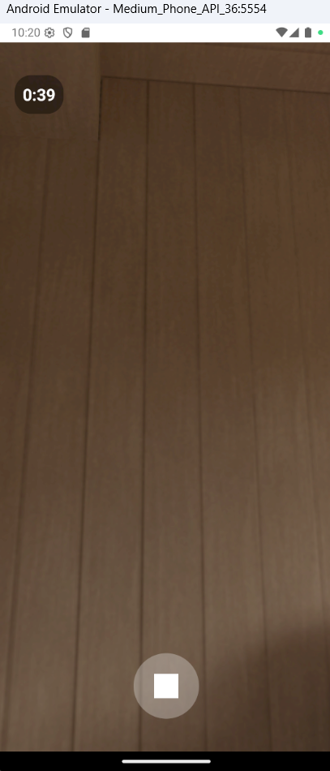
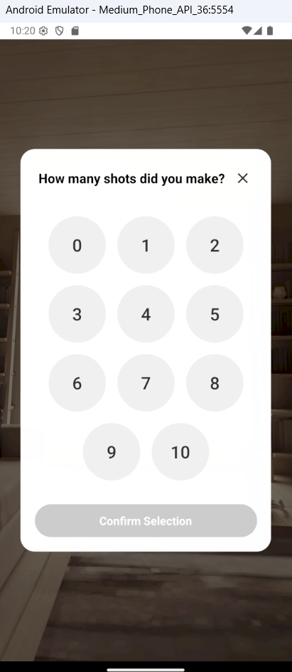
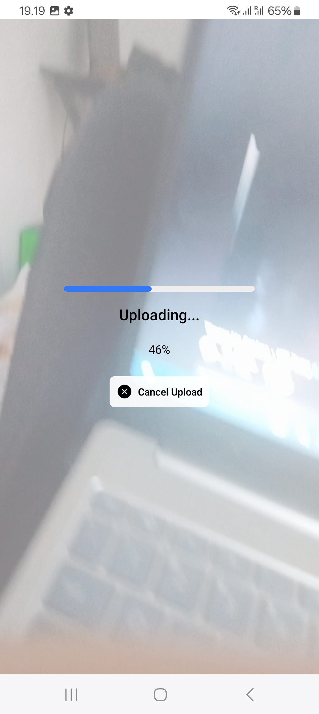
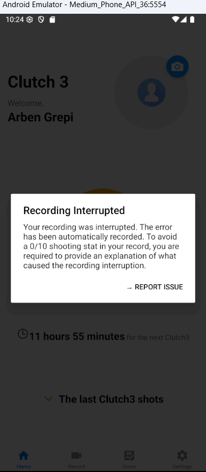
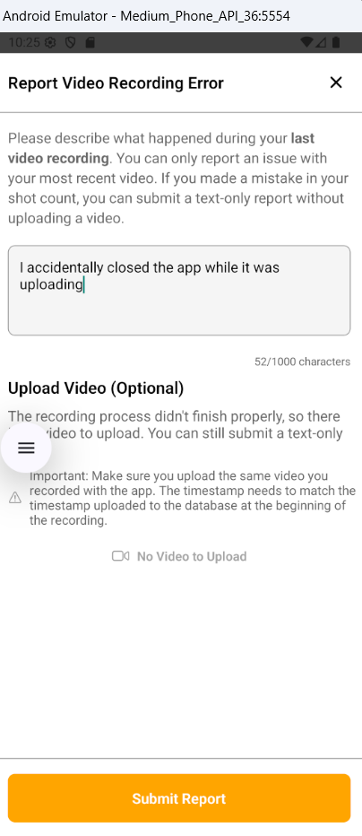
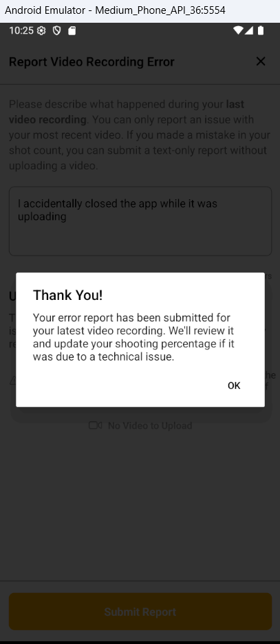
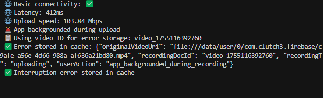

# Clutch3 - 3-Point Shooting Competition App

**Clutch3** is a competitive 3-point shooting app that tracks and vertifies users' 3-point shooting percentages. Users record Users can attempt **one shooting session per day**, where they attemt **10 consecutive shots** around the 3-point arc. The business logic in the backround **ensures** the user can only attemt shooting ones, because every initiated recording will create an initial record to the database that will be waiting for a response from an succesfully uploaded video. The latest 10 shot sessions (last 100 shot) creates the **Clutch3 shooting percentage**, which will be visible to other players and used to compete within the group. Players with the highest shooting percentage will appear at the top of the leaderboard.

The app calculates a **"Clutch3 percentage"** based on the last 10 shooting attempts. The competitive element comes from **real-time rankings** that show all users' shooting percentages in hierarchical order. This adds an element of competitiveness and motivates users to improve their accuracy for the next shooting session.

The app features **robust error handling** for recording interruptions and network failures, including attempts to stop the camera during poor shooting performances. Currently, I am developing another **AI-powered tool** that will automatically verify users' made shots on the backend and check the authenticity of videos (to prevent cheating attempts, such as recording a screen of a pre-recorded video).

## Technical Architecture

### Frontend

- **React Native** with **Expo Router** for navigation
- **TypeScript** for type safety
- **Context API** for state management (AuthContext, RecordingContext)
- **Custom Hooks** for data fetching and user interactions

### Backend & Storage

- **Firebase Firestore** for user data and video metadata
- **Firebase Storage** for video file storage
- **Firebase Authentication** for user management

### Video Processing

- **Expo Camera** for video recording
- **React Native Compressor** for video compression
- **Expo File System** for local file management
- **Error Recovery**: Cached error handling for failed uploads

### State Management

- **React Context** for global state management:
  - **AuthContext**: Manages user authentication state, Firebase user data, and app user profile information. Handles login/logout, user data synchronization with Firestore, and loading states.
  - **RecordingContext**: Tracks recording and uploading status across the app. Controls tab bar visibility during recording sessions and manages recording state globally.
- **Custom Hooks** for data fetching and business logic:

  - **useAuth()**: Provides access to current user, app user data, and authentication methods. This is the **authentication state manager** that handles login/logout, Firebase user state, and maintains the current user session. It's used for checking if a user is logged in and accessing basic user information.

  - **useUserData()**: Handles user data fetching, updates. This is a **data refresh utility** that fetches fresh user data from Firestore when needed (e.g., after profile updates or new video uploads). It's used for keeping user data synchronized with the database.

  - **useRecording()**: Manages recording state and upload status. This hook provides `isRecording` and `isUploading` boolean flags that control the app's UI behavior. It's used to hide the tab bar during recording/uploading sessions, prevent navigation interruptions.
  - **useCompetitionData()**: Manages global competition information and user participation toggles
  - **useRecordingAlert()**: Handles recording restriction alerts and eligibility checks. Enforces the 12-hour limit between recordings.

- **Cache Storage** for saving error information when recording/uploading is interrupted. Stores crash data, backgrounding events, and process interruptions in cache for later database analysis when the app reopens.

### Navigation

- **Expo Router** with file-based routing

## Clutch3 homepage

Homepage displays the user's current shooting statistics and provides easy access to recording functionality. The interface includes:

- **User Profile**: Displays user name and profile picture with camera icon for photo updates
- **Clutch3 Shooting Percentage**: Large basketball-style circle showing the last 100 shots percentage (e.g., if only 70 shots taken, it shows last 70). This represents the user's overall shooting accuracy across multiple sessions.
- **Record Button**: Prominent orange button with camera icon to initiate new Clutch3 shot recording session
- **Recent Performance Chart**: Visual chart showing made shots from the latest 10-shot session (each session has exactly 10 attempts). The chart is hidden by default and can be toggled visible.

## Recording Tab

Users can navigate to the Recording tab in two ways:

- **From Homepage**: Press the orange Record button
- **From Navigation**: Use the bottom navigation panel and select the "Record" tab

### Recording Instructions

Before starting the recording session, users read the instructions for recording 10 3-point shots. The app provides clear guidelines on:

- Shot positioning and distance requirements
- Time limit (60 seconds maximum)
- Recording process and what to expect
- How to properly complete the session

### After recording

The recording automatically stops after 10 shot attempts or when the 60-second time limit is reached. We then show the user a shot selection interface where they can set how many shots they made out of 10. This selection will be later confirmed using AI analysis of the video, or manually in rare occasions where the AI is not accurately detecting all the shots.

Users can close the shot selector and view the recorded video to count the shots again if necessary. They can also save the video to their phone for later upload, which is recommended if their internet connection quality is poor. Video originality is confirmed using metadata like timestamps to ensure authenticity.

## Video uploading

**Video gets first compressed**

The app uses react-native-compressor to compress videos (max 1280px, 1.5Mbps bitrate) before uploading to Firebase Storage. The process includes comprehensive error handling with network checks, file size validation (100MB limit), and progress tracking.

**then uploaded**
The upload process includes progress tracking, timeout monitoring (30-second threshold for stuck uploads), and automatic retry mechanisms. Videos are uploaded as blobs with custom metadata including original size, compressed size, and upload timestamp.

## Error Handling

The app has comprehensive error handling for any issues that occur during the recording/uploading process. The recording process begins when starting the recording, which creates a document in the database with the status of "recording". This document waits for either a successful upload response or an error update.

Various errors can occur, such as:

- **Compression failures**
- **Slow uploads due to poor internet connection**
- **User backgrounding or closing the app during recording/uploading**

In these cases, we save the latest event to the cache. The next time the user opens the app, we upload the latest video record status with an error object containing detailed information about the cause of the interruption.

If a video is taking too long to upload due to poor internet connection, we instruct the user to save the video locally and upload it manually when there's a better connection. Video authenticity is verified using timestamps that match the recording start time (recorded in the database at the beginning of the session).

When users stop the uploading process, we automatically send error information including internet connection status for analysis.

  

> ⚠️ **IMPORTANT**: This repository is for **portfolio and demonstration purposes only**.
>
> - **Commercial use is strictly prohibited**
